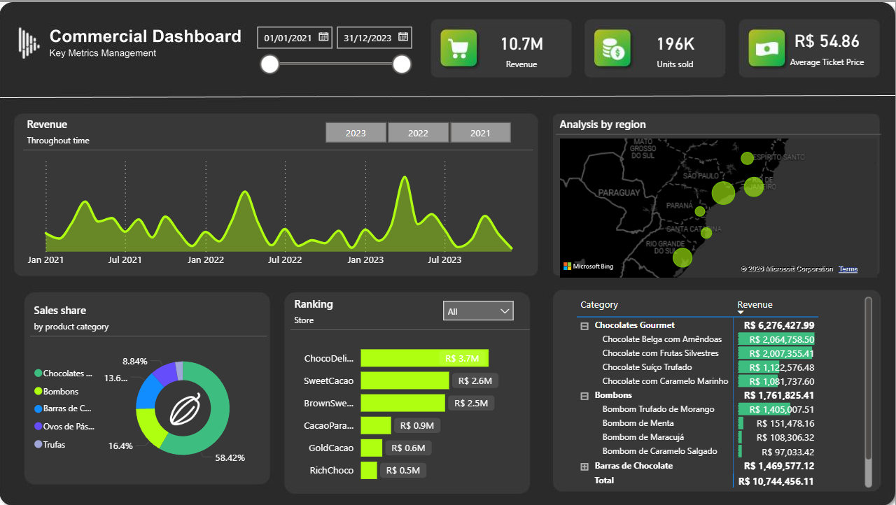

# Power BI Sales Dashboard

## Overview
This project analyzes sales performance across regions and products using Power BI.

## Tools
- Power BI
- Excel

## Key Insights
- Analyzed sales distribution to identify top-performing regions based on aggregated performance metrics
- Evaluated product-level sales trends to identify variation in demand across categories
- Identified underperforming segments to support performance gap analysis across regions and products

## Dashboard Preview

